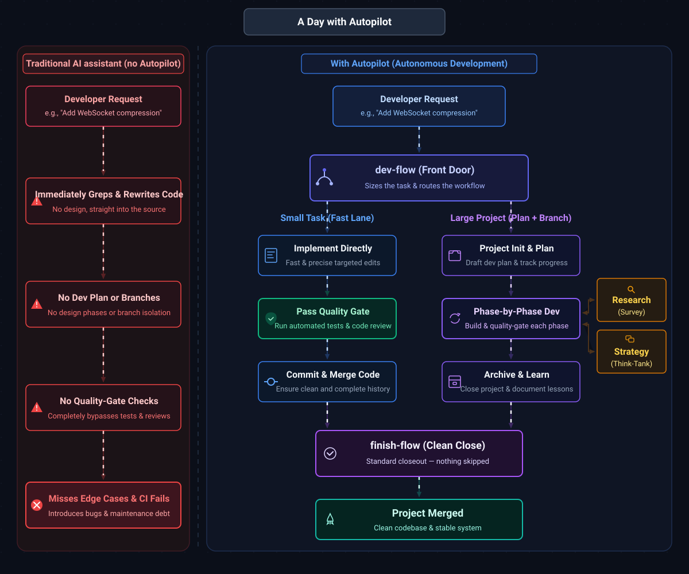

<div align="center">
  <table border="0" cellspacing="0" cellpadding="0">
    <tr>
      <td valign="middle"></td>
      <td width="24"></td>
      <td valign="middle"></td>
    </tr>
  </table>
</div>

<p align="center">
  
  
  
  
  
  
  
</p>

<p align="center">
  <b>English</b> &nbsp;|&nbsp; <a href="README.zh-TW.md">正體中文</a>
</p>

<p align="center">
  <b>The AI project lead for your terminal.</b><br>
  Claude Code is the full home base. Autopilot plans, delegates, reviews with a second engine, and remembers what it learned — with portable paths for Codex, OpenCode, and agy where their harnesses support them.
</p>

<p align="center">
  <sub>Distilled from 100+ completed AI-development projects.</sub>
</p>

```text
# autopilot's optional pre-push hook:
❯ git push
[autopilot] completeness scan …  ✗ TODO stub in auth.py:42
[autopilot] tests …              ✗ 1 skipped (payment flow)
[autopilot] review …             ⚠ unhandled error path
push blocked — fix it, or override with a reason
```

---

## What Is Autopilot?

Claude Code is still the most complete host. Autopilot makes AI coding agents **finish the job** — the planning, checking, deciding, and remembering you'd otherwise do by hand:

- **Hand it the goal, get back a result** — `/l3` `/l4` `/l5` `/l6` and `ceo-agent` can take a task end-to-end (sized, planned, built, reviewed, closed) and only stop to ask at the decisions that actually matter.
- **A second engine argues with your code** — reviews can run on a *different* model family (GPT, Gemini), so more bugs get caught before your users see them instead of being rubber-stamped by the same model that wrote them.
- **Catches the "done" that isn't** — a no-stub/no-TODO scan, your tests, and a real code review, run in the quality gate before you merge (and in the optional pre-push hook above).
- **Remembers, so your repo doesn't rot** — captures the lessons, tracks the project, tells you what to do next, and adapts to your repo from a single markdown file in `.claude/`.

It ships first as a Claude Code plugin — **28 skills, 3 methodology agents, 22 hooks, zero dependencies** — and keeps the same methodology portable where other harnesses expose compatible skill, agent, or plugin surfaces. It works fully on its own, and also plays nicely with the [`superpowers`](docs/coexistence.md) plugin if you have it.

> This README was written by Claude and adversarially reviewed by GPT-5.5 and Gemini through Autopilot's own second-engine review flow.

> New here? This page is the 5-minute tour. Everything deeper lives in **[Learn More](#learn-more)**.

## A Day With Autopilot

`dev-flow` is the front door. It sizes the task and routes it — small things go straight through the gate, large things become a tracked project:

<p align="center">
  <picture>
    <source media="(prefers-color-scheme: light)" srcset="docs/assets/flow.light.svg">
    
  </picture>
</p>

Without Autopilot, Claude starts grep-ing the codebase immediately — no plan, no phases, no quality gates. With it, the discipline is automatic.

## Quick Start

```bash
/plugin marketplace add cookys/autopilot
/plugin install autopilot@autopilot
```

That's it. Now **just talk to Claude** — Autopilot's skills trigger on what you say:

```
You: "I'm starting on WebSocket compression"   → sizes it, sets up a plan + branch + quality gates
You: "quick fix for the null check in auth"    → fast path, still gated before commit
You: "what should I work on next?"             → scans your projects and ranks them
You: "搞定這個重構，你決定"                       → full autonomous CEO mode
```

No commands to memorize — say it in your own words and the right skill steps in.

## Choose Your Path

Autopilot is Claude Code-first, but not Claude Code-only. Pick the entry point that matches the harness you actually use:

| If you are... | Start with | What you get |
|---|---|---|
| **Claude Code user** | The two-command install above | The complete path: skills, methodology agents, hooks, `/l3`-`/l6`, and plugin-managed defaults |
| **Codex user** | `.agents/skills/` in this repo, or the local package under `platforms/codex/plugin` | Autopilot skills plus bundled support payload for linked scripts/references; no Claude hook parity claim |
| **OpenCode user** | `.agents/skills/` plus `.opencode/opencode.json` | Shared skills and methodology agent bodies, with an OpenCode-specific in-process plugin wrapper |
| **Antigravity (`agy`) user** | `scripts/install-antigravity.sh` | Guarded import as a Claude Code-source plugin; no loose skills-dir scan |
| **Contributor** | `./scripts/dev-setup.sh --check` | A read-only readiness dashboard for Claude/Codex/OpenCode/agy; mutating non-Claude setup requires `--harness <name> --install` |

## From Principle To Default

The course-sized idea is simple: teach the agent the collaboration discipline once, then stop retyping it.

| Principle | Autopilot default |
|---|---|
| Clarify the work before coding | `dev-flow` expands goals into size, branch, plan, and gates |
| Ask for proof, not reassurance | `quality-pipeline` runs tests, scans for incomplete work, and reviews the diff |
| Preserve context outside the model | `project-lifecycle`, `handoff`, and `finish-flow` keep state readable by the next session |
| Don't let one brain self-approve | Heterogeneous review and qc panels read artifacts, not the implementer's story |
| Delegate by risk | `/l3`-`/l6` scale from inline autonomy to heterogeneous implementation and verification authoring |

## What It Does

28 skills, grouped by what you're trying to do. Each one triggers from natural language — the **Try saying** lines are real triggers.

### ✍️ Build code

`dev-flow` (start here — sizes & routes the task) · `quality-pipeline` (test → scan → review) · `finish-flow` (clean closing sequence, nothing skipped).

> **Try saying:** *"let's implement X"* · *"quick fix for Y"* · *"is this ready to commit?"*

### 🧭 Make decisions

`survey` (dual-agent industry research) · `think-tank` (6-role debate) · `brainstorm` (pre-code design exploration) · `think-tank-dialectic` (irreversible, high-stakes calls).

> **Try saying:** *"what do others use for X?"* · *"should we rewrite or patch?"* · *"要辯論一下"*

### 🤖 Full autopilot

`ceo-agent` (you set the goal, it executes) · `/l3` `/l4` `/l5` `/l6` (terse front-doors that pre-fill the CEO startup so one line ships the goal). They escalate **where the work runs**:

| | Runs where | Reach for it when |
|---|---|---|
| **`/l3`** | inline, on this thread | full autonomy, but you want to watch it happen |
| **`/l4`** | one background, worktree-isolated **foreman** | a long run you'd rather offload — your context stays clean, the authoritative quality verdict is held at depth 0 |
| **`/l5`** | `/l4`, but the **implementer is a different engine** (agy / Gemini) | cost-arbitrage, or a decorrelated second engine doing the mechanical coding |
| **`/l6`** | `/l5`, plus **verification authoring is delegated** to a different engine | when you want implementation and verification labor offloaded, while depth 0 keeps merge authority |

```
/l3 fix the flaky reconnect test, you decide     # inline
/l4 ship the WebSocket reconnect system          # offload to a background foreman
/l5 migrate the config loader to the new schema  # foreman + heterogeneous implementer
/l6 ship the parser rewrite                      # hetero implementer + hetero verification authoring
```

> **Try saying:** *"CEO mode, handle it"* · *"全權處理"* · *"/l4 ship the reconnect system"*

**→ Per-level behaviour, presets, override flags (`--expand` / `-x` / `--solo`), and full examples: [docs/skills.md](docs/skills.md).**

### Trust Model

Autopilot delegates labor, not authority. Implementer self-report is never evidence; reviewers read the task, diff, logs, and artifacts directly. Deterministic gates stay authoritative, higher-risk work needs decorrelated review coverage, and a `no_verdict` review never clears a gate.

### 🔌 Add another engine (optional)

Claude alone is enough. But point autopilot at a **second engine family** and its review/implement pipeline gets stronger — a cross-family qc panel catches what one vendor and its same-family reviewer jointly miss, and you get a heterogeneous implementer for cost-arbitrage. **Recommended order: a subscription you already pay for ≻ a metered API key** — OAuth-login runners (`codex` / `agy` / `grok`) need no token at all; GLM / MiniMax go in one canonical mode-600 file (`~/.autopilot/endpoints.env`) and are wired declaratively in `.claude/review-loop-config.md`.

> **Try saying:** *"set up a GLM reviewer"* · *"use MiniMax as the /l5 implementer"*

**→ Credential placement, the subscription-≻-API-key ladder, and the copy-paste setup: [docs/installation.md](docs/installation.md#heterogeneous-engine-credentials-optional--unlocks-the-strong-reviewimpl-roster).**

### 📈 Improve over time

`learn` (capture lessons) · `retro` (git-history retrospective) · `next` (what to do next) · `distill` (turn your repeated workflows into personal skills) · plus `debug` · `profiling` · `test-strategy` · `audit` · `doc-sync`.

> **Try saying:** *"record this for next time"* · *"回顧這週"* · *"what's the highest priority?"*

**→ Full catalog of all 28 skills, the three cognitive modes, and how they compose: [docs/skills.md](docs/skills.md).**

## Install

**Claude Code** (primary) — the two commands above. All 28 skills are available immediately as `autopilot:dev-flow`, `autopilot:survey`, etc.

### Harness Support

| Harness | How to start | Supported today | Known limits |
|---|---|---|---|
| **Claude Code** | `/plugin marketplace add cookys/autopilot` then `/plugin install autopilot@autopilot` | Full plugin path: 28 skills, 3 methodology agents, 22 hooks | Primary host; Claude-specific hooks and slash behavior do not automatically transfer to other harnesses |
| **Codex** | `.agents/skills/`, or `codex plugin add autopilot@autopilot-local` after adding `platforms/codex` as a marketplace | Skills-only package with generated support payload and repo-local marketplace | The default Codex package intentionally does not load Claude hooks, apps, or MCP servers |
| **OpenCode** | Open this repo with `.agents/skills/`; use `.opencode/opencode.json` for agents | Shared skills, methodology agent bodies, and an OpenCode plugin wrapper | Optional TypeScript deps are only needed when editing the wrapper; hook parity is platform-specific |
| **Antigravity (`agy`)** | `./scripts/install-antigravity.sh` | Guarded `agy plugin validate` / install / list flow with export-then-install | Runtime hook firing is still unverified; install does not imply hook behavior parity |

Full per-platform instructions, Windows notes, and the contributor **dev-mode** workflow are in **[docs/installation.md](docs/installation.md)**. Verified capability boundaries live in **[references/multi-agent-portability.md](references/multi-agent-portability.md)**.

## Learn More

The deep material, moved out of this page so it stays an onboarding tour:

| Topic | Doc |
|-------|-----|
| **All 28 skills** + three modes + how they compose | [docs/skills.md](docs/skills.md) |
| **Superpowers coexistence** — three scenarios, migration | [docs/coexistence.md](docs/coexistence.md) |
| **Per-project configuration** — the `.claude/` injection model | [docs/configuration.md](docs/configuration.md) |
| **Installation & development** — every platform, dev mode | [docs/installation.md](docs/installation.md) |
| **Architecture & design** — philosophy, methodology agents, credits | [docs/architecture.md](docs/architecture.md) |
| **Hooks** — 22 runtime-enforcement hooks (tiers in the doc) | [hooks/README.md](hooks/README.md) |
| **Changelog** | [CHANGELOG.md](CHANGELOG.md) |

## License

MIT — see [LICENSE](LICENSE) for details.
