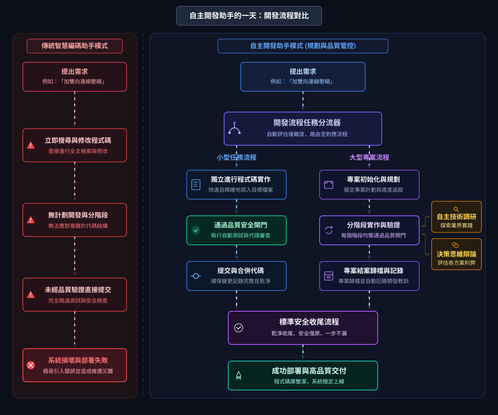

<div align="center">
  <table border="0" cellspacing="0" cellpadding="0">
    <tr>
      <td valign="middle"></td>
      <td width="24"></td>
      <td valign="middle"></td>
    </tr>
  </table>
</div>

<p align="center">
  
  
  
  
  
  
  
</p>

<p align="center">
  <a href="README.md">English</a> &nbsp;|&nbsp; <b>正體中文</b>
</p>

<p align="center">
  <b>你終端機裡的 AI 專案負責人。</b><br>
  Claude Code 是完整主場。Autopilot 負責規劃、委派、用第二個引擎審查、並記住學到的東西 —— 同時也為 Codex、OpenCode、agy 提供各自 harness 能支援的可攜路徑。
</p>

<p align="center">
  <sub>提煉自 100+ 個使用 AI 驅動開發完成的專案。</sub>
</p>

```text
# autopilot 的可選 pre-push hook：
❯ git push
[autopilot] completeness scan …  ✗ TODO stub in auth.py:42
[autopilot] tests …              ✗ 1 skipped (payment flow)
[autopilot] review …             ⚠ unhandled error path
push blocked — fix it, or override with a reason
```

---

## What Is Autopilot?

Claude Code 仍是最完整的 host。Autopilot 讓 AI coding agent **把整件事做完** —— 那些你本來得自己動手的規劃、檢查、決策與記憶：

- **給它目標，拿回結果** —— `/l3` `/l4` `/l5` `/l6` 和 `ceo-agent` 能把一個任務從頭跑到尾（判斷大小、規劃、實作、審查、收尾），只在真正該你拍板的決策點才停下來問。
- **第二個引擎來吵你的 code** —— 審查可以跑在**不同的**模型家族（GPT、Gemini）上，所以更多 bug 在使用者看到之前就被抓到，而不是被寫它的同一個模型蓋章放行。
- **抓出那種「假完成」** —— 無 stub/TODO 掃描、你的測試、真正的程式碼審查，在 quality gate 合併前跑（以及上面那個可選的 pre-push hook）。
- **會記住，所以你的 repo 不會爛掉** —— 記下教訓、追蹤專案、告訴你下一步做什麼，並從 `.claude/` 裡一個 markdown 檔適應你的 repo。

它優先以 Claude Code plugin 出貨 —— **28 個 skill、3 個方法論 agent、25 個 hook、零相依** —— 並在其他 harness 有相容 skill、agent 或 plugin surface 時，保留同一套方法論的可攜路徑。可完全獨立運作，若你有 [`superpowers`](docs/coexistence.md) 也能並存。

> 這份 README 是 Claude 寫的，並透過 Autopilot 自己的「第二引擎審查」流程，由 GPT-5.5 與 Gemini 對抗式審查而成。

> 第一次來？這頁是 5 分鐘導覽。更深的內容都在 **[Learn More](#learn-more)**。

## A Day With Autopilot

`dev-flow` 是前門。它判斷任務大小並分流 —— 小事直接過閘門，大事變成被追蹤的專案：

<p align="center">
  <picture>
    <source media="(prefers-color-scheme: light)" srcset="docs/assets/flow.zh-TW.light.svg">
    
  </picture>
</p>

沒有 Autopilot 時，Claude 會立刻開始 grep 程式碼 —— 沒有 plan、沒有 phase、沒有品質閘門。有了它，紀律是自動的。

## Quick Start

```bash
/plugin marketplace add cookys/autopilot
/plugin install autopilot@autopilot
```

就這樣。接著**直接跟 Claude 講** —— Autopilot 的 skill 會依你說的話觸發：

```
你：「我要開始做 WebSocket 壓縮」      → 判斷大小，建立 plan + 分支 + 品質閘門
你：「快速修一下 auth 的 null check」  → 快速路徑，commit 前仍經過閘門
你：「下一步做什麼？」                 → 掃描你的專案並排序
你：「搞定這個重構，你決定」            → 全自動 CEO 模式
```

不用背指令 —— 用你自己的話說出來，對的 skill 就會接手。

## 選擇你的路徑

Autopilot 是 Claude Code-first，但不是 Claude Code-only。依照你實際使用的 harness 選入口：

| 如果你是... | 從這裡開始 | 你會得到什麼 |
|---|---|---|
| **Claude Code 使用者** | 上面的兩行安裝指令 | 最完整路徑：skills、方法論 agents、hooks、`/l3`-`/l6`、plugin 管理的預設值 |
| **Codex 使用者** | 本 repo 的 `.agents/skills/`，或 `platforms/codex/plugin` 的 local package | Autopilot skills、bundled support payload，以及一條 production Codex-native `PostCompact` recovery hook；不宣稱 Claude hook parity |
| **OpenCode 使用者** | `.agents/skills/` 加 `.opencode/opencode.json` | 共用 skills、方法論 agent bodies，以及 OpenCode 專用的 in-process plugin wrapper |
| **Antigravity（`agy`）使用者** | `scripts/install-antigravity.sh` | 受 guard 保護的 Claude Code-source plugin 匯入；不是 loose skills-dir scan |
| **Contributor** | `./scripts/dev-setup.sh --check` | Claude/Codex/OpenCode/agy 的 read-only readiness dashboard；非 Claude 的 mutating setup 必須明確加 `--harness <name> --install` |

## 從原則到系統預設

課程版的大概念很簡單：把協作紀律教給 agent 一次，之後就不要每次重打。

| 原則 | Autopilot 預設 |
|---|---|
| 寫 code 前先釐清工作 | `dev-flow` 把目標展開成大小、分支、plan 與 gates |
| 要求證據，不接受安慰 | `quality-pipeline` 跑測試、掃未完成工作、審 diff |
| 把 context 保存在模型外 | `project-lifecycle`、`handoff`、`finish-flow` 讓下一個 session 讀得到狀態 |
| 不讓同一顆腦袋自己放行 | 異質 review 與 qc panel 讀 artifacts，而不是 implementer 自述 |
| 依風險放權 | `/l3`-`/l6` 從 inline 自主一路擴到異質實作與驗證撰寫 |

## What It Does

28 個 skill，依你想做的事分組。每個都從自然語言觸發 ——「Try saying」列出的就是真正的觸發語。

### ✍️ 寫程式

`dev-flow`（從這開始 —— 判斷大小並分流）· `quality-pipeline`（測試 → 掃描 → 審查）· `finish-flow`（乾淨收尾，一步不漏）。

> **Try saying：** *「我要開始做 X」* · *「快速修一下 Y」* · *「準備好可以 commit 了嗎」*

### 🧭 做決策

`survey`（雙 agent 業界調研）· `think-tank`（6 角色辯論）· `brainstorm`（寫程式前的設計探索）· `think-tank-dialectic`（不可逆、高風險決策）。

> **Try saying：** *「業界怎麼做 X？」* · *「該重寫還是修補？」* · *「要辯論一下」*

### 🤖 全自動

`ceo-agent`（你定目標，它執行）· `/l3` `/l4` `/l5` `/l6`（簡潔前門，預填 CEO 啟動四問，一行就把目標送出去）。各級的差別在**實作在哪裡跑**：

| | 在哪裡跑 | 何時用 |
|---|---|---|
| **`/l3`** | inline，這條 thread 上 | 全自主，但你想盯著它跑 |
| **`/l4`** | 一個背景、worktree 隔離的 **foreman** | 想把長時間自主跑的工作 offload — 你的 context 保持乾淨，權威品質判定握在 depth 0 |
| **`/l5`** | 同 `/l4`，但**實作交給不同引擎**（agy / Gemini） | 成本套利，或讓一個去相關化的第二引擎做機械式實作 |
| **`/l6`** | 同 `/l5`，再把**驗證撰寫**交給不同引擎 | 想把實作與驗證撰寫都外包，但 depth 0 仍保留合併權限 |

普通 strict `/l5` Engine 執行採 fail-closed：workflow dispatch 前，CLI 必須把 exact
implementer／reviewer／verification-author／QC roster 對上 Autopilot 凍結的 provider policy，
並消費 fresh、host-owned qualification 與 live-readiness evidence。Lower-level 與 legacy flow
維持明確 non-strict，不會冒稱 strict L5。

```
/l3 fix the flaky reconnect test, you decide     # inline
/l4 ship the WebSocket reconnect system          # offload 給背景 foreman
/l5 migrate the config loader to the new schema  # foreman + 異質實作引擎
/l6 ship the parser rewrite                      # 異質實作 + 異質驗證撰寫
```

> **Try saying：** *「CEO 模式，幫我處理」* · *「全權處理」* · *「/l4 把重連系統做掉」*

**→ 各級行為、預設值、override flags（`--expand` / `-x` / `--solo`）與完整範例：[docs/skills.md](docs/skills.md)。**

### 信任模型

Autopilot 委派 labor，不委派權威。Implementer 的自述永遠不是證據；reviewer 直接讀任務、diff、log 與 artifacts。Deterministic gates 仍是權威，高風險工作需要去相關化的 review coverage，而 `no_verdict` review 永遠不能算通過。

### 能力自適應 Guidance

Autopilot 維持一個產品，同時容納強、弱、遠端與本地模型。系統先驗證精確的
role + task scope + deployment identity，再只編譯一份 guidance payload：
`guided` 給較小的當前切片與明確結構；`autonomous` 對已合格的角色移除重複流程。
兩種 profile 都不會改動紅線、effects、egress、assurance 或 acceptance。

`governance.guidance_profile` 是專案預設（省略時為 `guided`），每個 task 可在 intake
覆寫而不修改專案設定。外部 benchmark 只能產生 provisional telemetry；owner 與
reviewer 使用不同的 host-scored eval，磁碟 JSON 不能重建 session authority。
本 repo 的 v2.33.0 cutover receipt 仍是 `hold_guided`：autonomous control source
少 113 bytes，但目前沒有 exact host-token measurement、effectful compatibility witness、
仍有效的 live owner verifier，以及五筆完整獨立 dogfood receipt。本地
OpenAI-compatible adapter 已通過 fake-contract transport 測試，但不宣稱任何 live
local runtime 或 agentic local runner。

### 🔌 接上另一個引擎（選用）

只用 Claude 就夠了。但把 autopilot 指向**第二個引擎家族**，它的 review／implement pipeline 會更強——跨家族 qc panel 能抓到單一廠商跟同家族 reviewer 一起漏掉的問題，還能得到一個異質 implementer 做成本套利。**建議順序：你已經在付的訂閱 ≻ 按量計費的 API key**——OAuth 登入的 runner（`codex` / `agy` / `grok` / explicit-only `qoderclicn`）完全不需要 token；GLM／MiniMax 則放進單一 mode-600 檔案（`~/.autopilot/endpoints.env`），並在 `.claude/review-loop-config.md` 宣告式接線。

> **Try saying：** *「設一個 GLM reviewer」* · *「用 MiniMax 當 /l5 implementer」*

**→ 憑證放置、subscription-≻-API-key 階梯與可直接複製的設定：[docs/installation.md](docs/installation.md#heterogeneous-engine-credentials-optional--unlocks-the-strong-reviewimpl-roster)。**

### 📈 自我改進

`learn`（記錄教訓）· `retro`（git 歷史回顧）· `next`（接下來做什麼）· `distill`（把你重複的流程變成個人 skill）· 以及 `debug` · `profiling` · `test-strategy` · `audit` · `doc-sync`。

> **Try saying：** *「記下來供下次使用」* · *「回顧這週」* · *「最高優先是什麼？」*

**→ 全部 28 個 skill 的完整目錄、三種認知模式、以及彼此如何組合：[docs/skills.md](docs/skills.md)。**

## Install

**Claude Code**（主要）—— 上面那兩行指令。28 個 skill 立即可用，如 `autopilot:dev-flow`、`autopilot:survey` 等。

### Harness 支援矩陣

| Harness | 如何開始 | 目前支援 | 已知限制 |
|---|---|---|---|
| **Claude Code** | `/plugin marketplace add cookys/autopilot` 後 `/plugin install autopilot@autopilot` | 完整 plugin 路徑：28 個 skills、3 個方法論 agents、25 個 hooks | 主要 host；Claude-specific hooks 與 slash 行為不會自動轉移到其他 harness |
| **Codex** | `.agents/skills/`，或加入 `platforms/codex` marketplace 後 `codex plugin add autopilot@autopilot-local` | Skills、generated support payload，以及一條 production `PostCompact` recovery hook（`manual\|auto`） | 這是 Codex-native recovery boundary，不代表 Claude hook parity；不載入 Claude hook bundle、apps 或 MCP servers。經 `spawn_agent` 的 subagent model 路由需 user 自行 opt-in — 見 `platforms/codex/README.md` |
| **OpenCode** | 在這個 repo 使用 `.agents/skills/`；agents 走 `.opencode/opencode.json` | 共用 skills、方法論 agent bodies、OpenCode plugin wrapper | Optional TypeScript deps 只在編輯 wrapper 時需要；hook parity 屬平台特定問題 |
| **Antigravity（`agy`）** | `./scripts/install-antigravity.sh` | 受 guard 保護的 `agy plugin validate` / install / list 流程，採 export-then-install | Runtime hook firing 仍未驗證；install 不代表 hook behavior parity |

完整各平台說明、Windows 注意事項與貢獻者 **dev-mode** 流程在 **[docs/installation.md](docs/installation.md)**。已驗證的 capability 邊界在 **[references/multi-agent-portability.md](references/multi-agent-portability.md)**。

## Learn More

深入的內容，移出本頁讓它保持為 onboarding 導覽：

| 主題 | 文件 |
|------|------|
| **全部 28 個 skill** + 三種模式 + 如何組合 | [docs/skills.md](docs/skills.md) |
| **Superpowers 並存** —— 三種情境、遷移 | [docs/coexistence.md](docs/coexistence.md) |
| **各專案設定** —— `.claude/` 注入模型 | [docs/configuration.md](docs/configuration.md) |
| **安裝與開發** —— 每個平台、dev mode | [docs/installation.md](docs/installation.md) |
| **架構與設計** —— 哲學、方法論 agent、致謝 | [docs/architecture.md](docs/architecture.md) |
| **Hooks** —— 25 個 runtime 強制 hook（分層見該文件） | [hooks/README.md](hooks/README.md) |
| **Changelog** | [CHANGELOG.md](CHANGELOG.md) |

## License

MIT —— 詳見 [LICENSE](LICENSE)。
